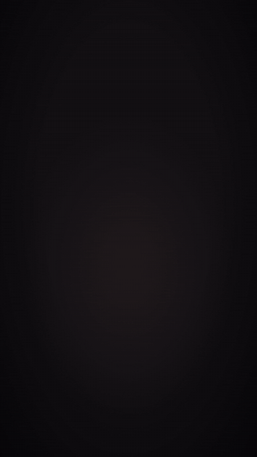

# video-motion

Skill para o [Claude Code](https://claude.com/claude-code) que cria **vídeos de motion graphics feitos em código**
para qualquer marca: anúncios, lançamentos de função, showcases, stories e tutoriais.
Você descreve o vídeo e o Claude escreve o roteiro, monta as cenas, sintetiza a trilha e os efeitos,
renderiza e confere tudo antes de entregar o MP4.

<p align="center"></p>

*Demo de 4 s gerada com o kit de exemplo (padaria fictícia "Aurora"). [MP4 com som](docs/demo-aurora.mp4).*

## O que ele faz

- **Vídeo vertical 1080x1920 a 60 fps**, com movimento suave e desfoque de movimento de verdade.
- **Cada marca tem seu kit** (`marca.yaml` + fontes + logo). O mesmo motor serve para todos os seus projetos:
  cores, tipografia, logo, idioma e regras saem do kit.
- **Trilha e efeitos sonoros sintetizados** no próprio computador, no ritmo do vídeo, sem música de banco.
  Cada som cai no quadro exato do que aparece na tela.
- **Revisão automática antes de entregar**: quadros e fps, volume no padrão das redes (-14 LUFS),
  sincronia entre imagem e som, e texto (palavras proibidas, números não liberados, travessão, emoji).
- **Processo com aprovação**: briefing, roteiro em tabela para você aprovar e, nas peças de marca,
  3 direções visuais para você escolher antes de construir.

## Requisitos

- [Claude Code](https://claude.com/claude-code)
- [Node.js](https://nodejs.org) 18 ou mais novo
- [Python](https://www.python.org) 3.10 ou mais novo
- Uns 500 MB livres (Chromium e pacotes, instalados uma vez só)

Testado no Windows 11. O motor foi escrito para funcionar também no macOS e no Linux; se encontrar
algum problema, abra uma issue.

## Instalação

**Opção 1: como plugin (recebe atualizações)**, dentro do Claude Code:

```
/plugin marketplace add welingtondesosa/video-motion
/plugin install video-motion@video-motion
```

**Opção 2: cópia manual.** Copie a pasta `skills/video-motion` deste repositório para `~/.claude/skills/`
(no Windows, `C:\Users\<você>\.claude\skills\`).

Depois, uma vez por máquina, peça ao Claude: *"prepare o video-motion"*. Ou rode você mesmo, dentro da
pasta da skill:

```
node template/tools/setup.mjs
```

Ele instala o Playwright e o Chromium em `~/.video-motion/deps` e os pacotes de Python
(numpy, soundfile, pyyaml, imageio-ffmpeg, que já traz o ffmpeg).

## Como usar

1. Abra o Claude Code **na pasta do projeto da sua marca** (site, app, loja).
2. Peça o vídeo. Exemplos:
   - *"Crie um anúncio de 30 s mostrando como o cliente faz o pedido pelo site."*
   - *"Quero um vídeo de lançamento de 60 s da nova função X, com comparação antes e depois."*
   - *"Faça um story de 10 s com a nossa promoção desta semana."*
3. Na primeira vez, o Claude monta o **kit de marca** lendo o código do projeto (cores, fontes, logo,
   o que o produto faz) e salva em `.claude/video-marca/`. Confira e aprove.
4. Responda ao briefing, aprove o roteiro e, se for peça de marca, escolha uma das 3 direções visuais.
5. Receba o MP4 (até 30 MB), a capa em PNG e um master em alta qualidade.

Quer só testar sem ter um projeto? Peça: *"faça o vídeo de demo do video-motion com o kit de exemplo"*.

## Kit de marca

Cada projeto guarda o seu em `.claude/video-marca/`:

```
.claude/video-marca/
  marca.yaml     nome, site, idioma, tagline, chamada, cores, fontes, logo, regras
  fonts/         arquivos de fonte locais (.woff2, .ttf, .otf)
  assets/        ícone e logo (svg ou png)
```

O formato completo está em [`skills/video-motion/references/kit-de-marca.md`](skills/video-motion/references/kit-de-marca.md)
e um kit pronto em [`skills/video-motion/exemplo-kit/`](skills/video-motion/exemplo-kit/).

No `marca.yaml` também ficam as **regras da marca**: concorrentes e fornecedores que nunca aparecem,
o aviso de cena encenada, os fatos que podem ser ditos e os cuidados (preços por mercado, promessas).

## Regras que o motor segue

- **Nenhum número inventado.** Só números medidos ou publicados pela marca, liberados um a um no roteiro.
- **Nada de concorrentes nem fornecedores na tela.** A lista vem do kit e o `check_text` confere.
- **Pessoas e conversas encenadas com nomes fictícios** e aviso na tela. Avatar nunca se passa por cliente.
- **Texto limpo**: sem travessão nem emoji por padrão (o kit pode liberar).
- **Uma ideia por cena**, com texto parado tempo suficiente para ler.

## O que tem dentro

```
skills/video-motion/
  SKILL.md           instruções que o Claude segue (fluxo, regras, checklist)
  references/        kit de marca, banco de 15 formatos de vídeo, processo, lições aprendidas, avatares
  template/          o motor: cenas em HTML/CSS/JS, render com Playwright, áudio em numpy, montagem com ffmpeg
  exemplo-kit/       marca fictícia com fontes livres (SIL OFL)
```

Os comandos do motor estão explicados em [`skills/video-motion/template/README.md`](skills/video-motion/template/README.md).

## Licença

[MIT](LICENSE). As fontes do kit de exemplo são SIL Open Font License 1.1 (licenças em `exemplo-kit/fonts/`).
Os vídeos que você gerar são seus. Ao montar o kit da sua marca, use só fontes, logos e imagens que você tem
direito de usar.

---

## English

**video-motion** is a Claude Code skill that makes code-built motion graphics videos (ads, feature launches,
brand showcases, stories) for any brand. Each project keeps a brand kit (`.claude/video-marca/marca.yaml` +
fonts + logo) and the same engine renders 1080x1920 60 fps video with motion blur, a synthesized
soundtrack locked to the picture, and automated checks (frames, loudness at -14 LUFS, audio/visual sync,
banned words and unapproved numbers).

Install with `/plugin marketplace add welingtondesosa/video-motion` and
`/plugin install video-motion@video-motion`, then run `node template/tools/setup.mjs` once. The skill
instructions and docs are in Brazilian Portuguese; Claude answers in your language and writes on-screen
text in the language set in the brand kit.
